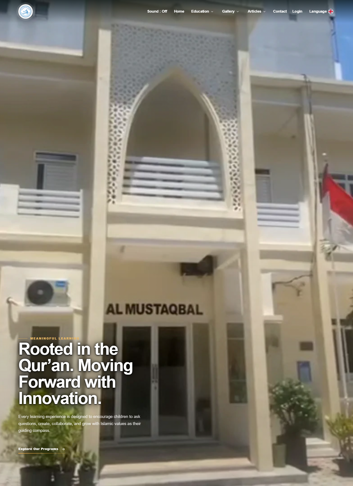

<div align="center">

# SchoolAI

### Production school digital platform with multilingual public UX, role-based portals, an operational CMS, and explicit production web standards

**Laravel 13 · PHP 8.3+ · Tailwind CSS 4 · Vite 8 · Pest 4 · Three.js · S3-compatible media**

[Live Site](https://almustaqbal.sch.id) · [Production Standards](#production-web-standards) · [Product Surface](#product-surface) · [UI & CMS](#ui--cms-engineering) · [Verification](#verification-snapshot) · [Setup](#local-setup) · [License](#license)

</div>

<p align="center">
  
</p>

> **SchoolAI is not a template-driven school website.** It is a maintained production application that combines a multilingual public experience, editorial workflows, admissions content, gallery composition, role-specific portals, account/session controls, security boundaries, media infrastructure, regression contracts, and constrained-hosting deployment in one system.

---

## Verification Snapshot

Point-in-time verification from **2026-10-01** after the Laravel security update:

| Check | Result |
|---|---|
| Framework | Laravel **13.34.0** |
| Backend regression suite | **304 tests / 3,487 assertions — PASS** |
| Composer security audit | **0 security advisories** |
| npm audit | **0 vulnerabilities** |
| Production frontend build | **PASS** with Vite 8 |
| GitHub Actions | **GREEN** |

These numbers are a snapshot, not a permanent badge of perfection. The purpose is to make the current engineering state inspectable instead of relying on claims that cannot be reproduced.

---

## Why SchoolAI Exists

A school website stops being “just a website” once staff need to publish content without editing source code, visitors need the same information in multiple languages, Arabic needs correct RTL behavior, teachers and students need separate access boundaries, admissions state changes over time, media must survive independently from the application host, and public pages still have to remain secure, usable, and maintainable.

SchoolAI was built around those operational realities.

The public presentation layer, authenticated portals, content workflows, media lifecycle, account state, deployment behavior, and security policies are treated as parts of one product rather than unrelated pages glued together after the fact.

---

## Production Web Standards

SchoolAI intentionally makes production behavior explicit. The goal is not to claim formal certification or a third-party penetration test. The goal is to make important web guarantees visible in source code and regression tests.

### Security baseline

The application has automated contracts around public and authenticated surfaces for:

- nonce-based **Content Security Policy**;
- `X-Content-Type-Options: nosniff`;
- `X-Frame-Options: DENY`;
- `Referrer-Policy: strict-origin-when-cross-origin`;
- restrictive `Permissions-Policy` for camera, microphone, geolocation, payment, and USB;
- production-only **HSTS** on secure requests;
- canonical production HTTPS redirects;
- explicit external-origin allowlists instead of wildcard framing or asset policies;
- secure and HTTP-only session-related cookies with `SameSite=Lax` behavior;
- CSRF protection on state-changing routes;
- stateful OAuth callbacks rather than stateless authentication shortcuts;
- HTML escaping for database-backed public content;
- frontend contracts that reject common HTML-string injection sinks such as `innerHTML`, `insertAdjacentHTML`, and `document.write` in sensitive presentation paths.

Security is therefore treated as an application contract, not a collection of headers somebody remembers to configure once.

### Authentication and session boundaries

Authenticated behavior is separated by role and portal:

- administrator;
- teacher;
- student.

Protected areas are guarded by authentication, role boundaries, active-account state, and active-session state. Account/session workflows include dedicated application services rather than relying only on controller-local conditionals.

The authentication surface includes:

- traditional portal login flows;
- Google OAuth for staff entry;
- role-aware redirect behavior;
- throttled OAuth routes;
- active-session invalidation;
- logout session invalidation;
- student password management;
- account-state enforcement before protected dashboards are served.

### Mutation safety

State-changing behavior is intentionally kept off GET routes where applicable. Regression coverage verifies mutation boundaries such as language preference changes and logout behavior, and validates CSRF enforcement in production-mode request handling.

### Accessibility-conscious presentation

SchoolAI does not claim a formal WCAG certification. It does, however, keep accessibility behavior under regression coverage where the product depends on it.

Current contracts include:

- semantic hidden descriptions for editorial headings;
- screen-reader-only copy while decorative/animated copies remain `aria-hidden`;
- locale-aware public presentation;
- Arabic RTL presentation paths;
- interaction and navigation contracts that remain explicit across public surfaces.

### Performance and first-paint ownership

Frontend performance is treated as architecture, not an afterthought added after Lighthouse screenshots.

Regression contracts cover concerns such as:

- keeping interaction-heavy styles out of the initial first-paint path;
- dedicated critical CSS ownership;
- production inlining of asset-safe critical styles;
- selective font preloading;
- self-hosted public typography paths;
- locale-specific typography ownership for Latin and Arabic surfaces;
- avoiding known synchronous layout-restart patterns in homepage JavaScript;
- avoiding repeated homepage data reconstruction within a request;
- avoiding runtime schema probes in the normal homepage path;
- explicit source-structure verification alongside the Vite build.

The production frontend still remains measurable software, not “finished forever”; bundle size and runtime behavior should continue to be monitored as features evolve.

### Media and content safety

Public media is designed to live outside the application host through an S3-compatible storage layer and canonical public media URL.

The codebase includes regression coverage around:

- article media lifecycle;
- gallery media lifecycle;
- hero media behavior;
- PPDB media lifecycle;
- canonical media ownership;
- image dimensions and presentation metadata;
- replacement/archive/restore behavior;
- preservation of still-referenced objects;
- safe image-upload boundaries.

This matters because “upload an image” is not a single operation once media is reused, archived, replaced, rendered across locales, and stored remotely.

---

## Product Surface

| Surface | What it handles |
|---|---|
| Public website | homepage experience, multilingual navigation, PPDB/admissions, articles, gallery |
| Language system | Indonesian, English, and Arabic public locales, including RTL presentation paths |
| Article platform | native article pages, administration, visual canvas workflow, autosave, media, publishing |
| Homepage editorial control | article pinning, hero/homepage placement, and explicit ordering |
| Gallery system | canonical media, configurable page sections, visibility, ordering, placement, archive/restore |
| PPDB / admissions | public admissions state, settings, showcase items, ordering, archive/restore |
| Admin portal | content operations, account administration, editorial controls, presentation controls |
| Teacher portal | dedicated authenticated teacher entry and dashboard boundary |
| Student portal | dedicated login, dashboard, account page, and password management |
| Authentication | traditional login, Google OAuth staff flows, role-aware routing |
| Operational controls | active-account checks, active-session checks, audit logging, account revision/state management |
| Media infrastructure | S3-compatible storage with external canonical media delivery |
| Deployment | reproducible cPanel-oriented build/package workflow |

---

## UI & CMS Engineering

The frontend is treated as product behavior rather than a collection of static Blade pages.

### Multilingual public experience

The public site supports three explicit locales:

- Indonesian (`id`)
- English (`en`)
- Arabic (`ar`)

Locale switching is persisted and guarded so public language navigation does not accidentally redirect visitors into admin or authentication surfaces. Arabic is treated as a real presentation mode with RTL-specific typography and layout contracts rather than as translated strings dropped into an LTR design.

### Native article workflow

The article platform goes beyond basic CRUD. The administration layer includes:

- article creation and editing;
- a dedicated native article canvas;
- canvas autosave;
- image upload from the editor;
- optional Unsplash search integration;
- explicit publish actions;
- dedicated thumbnails;
- homepage pin/unpin controls;
- hero/homepage placement behavior;
- manual ordering;
- scheduled/public visibility behavior;
- soft delete and restore workflows.

Editorial presentation therefore stays inside the product instead of requiring developers to manually rebuild pages for routine content operations.

### Gallery composition

The gallery system supports both canonical media inventory and higher-level page composition:

- gallery item CRUD;
- visibility toggles;
- manual ordering;
- soft delete / restore;
- configurable gallery sections;
- section-level media placement;
- one canonical media item placed in multiple sections;
- section activation and ordering behavior;
- replacement rules that preserve shared media when it is still referenced elsewhere.

Media is not only stored. It is composed into controlled presentation structures with lifecycle rules.

### PPDB / admissions presentation

Admissions content is controlled from the admin surface through:

- PPDB settings;
- open/closed behavior;
- localized public state;
- showcase items;
- showcase ordering;
- edit, archive, restore, and replacement flows.

This keeps a time-sensitive public area editable without turning every admissions change into a deployment.

### Role-specific portal UX

Authentication and navigation are separated for administrators, teachers, and students. The application resolves authenticated users into the correct area and applies role, account-state, and active-session rules before protected surfaces are reached.

---

## Backend Structure

The source tree uses explicit application boundaries instead of pushing every concern into controllers and Eloquent models.

| Area | Responsibility |
|---|---|
| `app/Actions` | focused application operations |
| `app/Services` | reusable operational and domain-facing services |
| `app/Rules` | custom validation behavior |
| `app/Enums` | explicit state/value definitions |
| `app/Http` | request, middleware, and controller boundaries |
| `app/Models` | persistence models |
| `app/Support` | cross-cutting application support |
| `app/View` | presentation-oriented helpers |
| `routes/web` | public and authentication routing |
| `routes/admin` | separated admin feature routing |
| `tests` | feature/unit regression and architecture-style contracts |

Routes are split by product area instead of accumulating unrelated behavior in one monolithic route file.

---

## Engineering Controls

### Account and audit concerns

The application includes dedicated services for account directory behavior, account revision handling, active-session management, audit logging, and PPDB access policy. This keeps account state and operational history from becoming incidental controller logic.

### Soft-delete and restore behavior

Articles, gallery content, PPDB content, and related presentation records use explicit archive/restore behavior where applicable. Regression coverage verifies replacement candidates and protects unrelated active records from accidental replacement.

### Regression-first maintenance

The test suite is intentionally broad because the application has many coupled presentation and operational contracts. Coverage includes areas such as:

- authentication and role isolation;
- account/session lifecycle;
- security headers and cookies;
- CSRF and mutation boundaries;
- XSS boundaries;
- multilingual seed/data parity;
- public navigation contracts;
- accessibility-sensitive presentation;
- article publishing and placement;
- gallery canonicalization and media placement;
- PPDB behavior;
- R2/S3-compatible media lifecycle;
- homepage composition;
- CSS ownership and stylesheet deferral;
- performance hardening;
- production HTTPS behavior;
- timezone consistency;
- audit logging.

The objective is not “tests exist, therefore bugs do not.” The objective is that important behavior becomes harder to break silently.

---

## Technology Stack

| Layer | Technology |
|---|---|
| Backend | Laravel 13, PHP 8.3+ |
| Current verified framework snapshot | Laravel 13.34.0 |
| Authentication | Laravel auth flows, Socialite / Google OAuth |
| Frontend | Blade, Tailwind CSS 4 |
| Build tooling | Vite 8 |
| Interactive graphics | Three.js |
| Typography | self-hosted Inter + Arabic/Cairo assets |
| Media | Laravel filesystem with S3-compatible storage |
| Testing | Pest 4 |
| Static analysis / quality tooling | Larastan, PHP Insights, Pint |
| Database | Laravel-supported relational database layer; SQLite in-memory test workflows |
| Deployment | cPanel-oriented production package workflow |
| CI | GitHub Actions dependency/regression verification |

---

## Verification Commands

Core project checks are kept close to the repository:

```bash
composer test
composer audit --locked --no-interaction
npm ci
npm audit
npm run build
npm run check:structure
```

Development dependencies also include Larastan, PHP Insights, and Pint for static analysis and source-quality workflows.

A clean local verification should be treated as evidence, not as permission to skip CI.

---

## Deployment

The repository contains a dedicated cPanel packaging workflow rather than assuming an unrestricted VPS environment.

```bash
make deploy
```

The deployment Makefile builds a package around explicit application, public-directory, deployment-directory, and site URL parameters. Production HTTPS/canonical-host behavior is also kept under regression coverage.

The point is reproducibility: deployment knowledge should live in the repository, not only in somebody's memory or in a hosting control panel tab left open for six months.

---

## Local Setup

```bash
git clone https://github.com/Asyraf2003/schoolai.git
cd schoolai

composer install
cp .env.example .env
php artisan key:generate
php artisan migrate

npm install
npm run build

php artisan serve
```

For the combined development workflow:

```bash
composer run dev
```

For the current Linux/WSL development path, PHP must include the database extensions required by the chosen environment; the test suite uses SQLite in-memory workflows and therefore requires PDO SQLite support.

Configure OAuth, database, and external media credentials only through environment variables. No production credentials are intended to live in this repository.

---

## What This Repository Demonstrates

SchoolAI is intended to show more than the ability to assemble a school landing page.

It demonstrates:

- turning a public website into an operational publishing product;
- multilingual product design across Indonesian, English, and Arabic;
- RTL-aware public presentation;
- separate administrator, teacher, and student interaction boundaries;
- native editorial workflows with autosave, publishing, ordering, and restore behavior;
- canonical gallery/media composition instead of one-off uploads;
- admissions state controlled from application data;
- role/account/session enforcement around authenticated areas;
- explicit web security policies with regression tests;
- accessibility-conscious semantic presentation;
- first-paint and frontend performance ownership encoded as contracts;
- externally hosted media with lifecycle rules;
- reproducible shared-hosting deployment;
- a regression suite large enough to protect both UI behavior and backend rules.

In short: **the standard is not “does the homepage look good?”** The standard is whether content, security, language, roles, media, performance, deployment, and operations continue to behave coherently as the product changes.

---

## Related Project

For transaction-heavy backend and financial-integrity work, see **[GlassPos](https://github.com/Asyraf2003/GlassPos)**, a workshop POS and operational system built around state coherence, auditability, inventory, payments, refunds, cancellation semantics, and reporting.

SchoolAI represents the product/UI/content-platform side of my engineering work; GlassPos represents the transaction-integrity and operational-systems side.

---

## License

Copyright © 2026 Asyraf Mubarak. All rights reserved.

This repository is **source-available for viewing and portfolio evaluation, not open source**. No permission is granted to use, copy, modify, distribute, sublicense, sell, or create derivative works from this project without prior written permission.

See [`LICENSE`](LICENSE) for the full terms.

<div align="center">

### A school website becomes software engineering when content, roles, media, language, security, performance, and operations all have to stay coherent.

</div>
